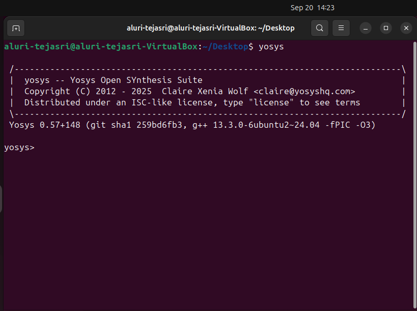
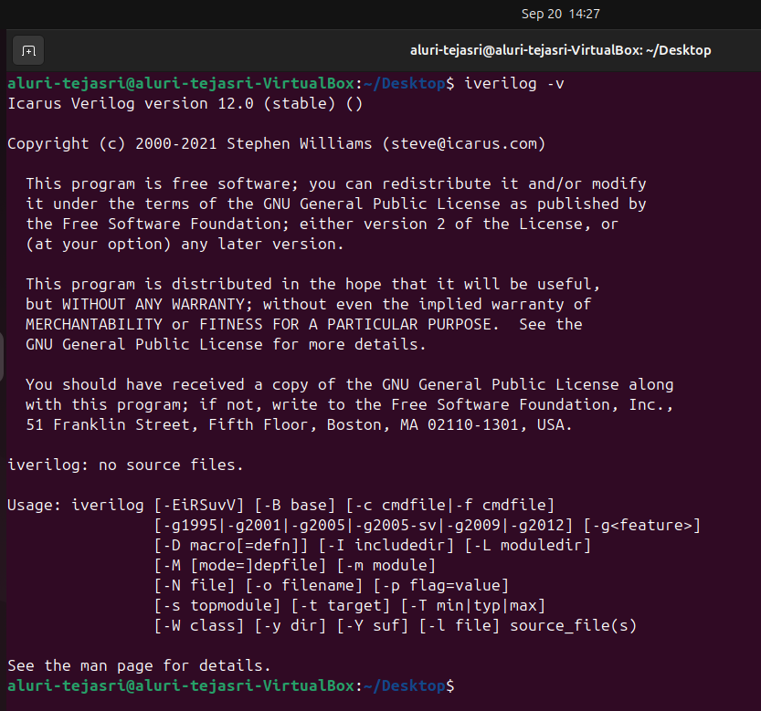
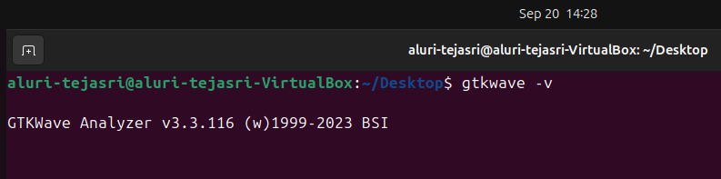
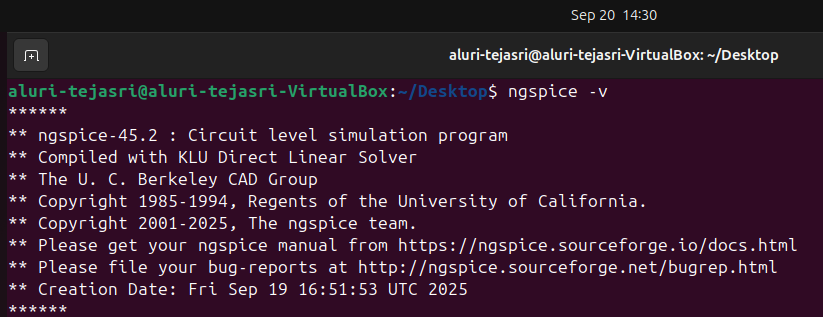
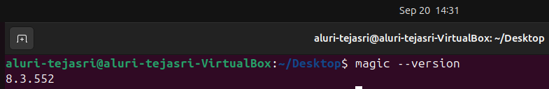
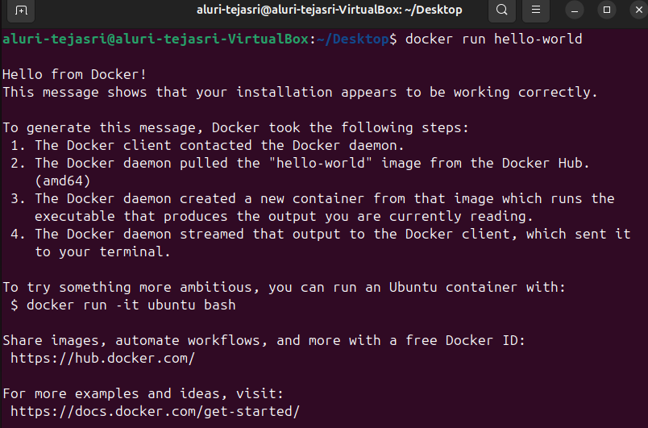
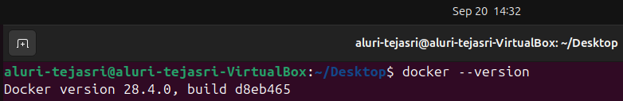

**Week 0 – Task 2: Tool Installation & Snapshots**

This document provides a summary of the tools installed on my virtual machine as part of the VSD program. All tools have been installed following the recommended system configuration, and their installation has been verified with snapshots.

**System Configuration**

**RAM:** 6 GB

**HDD:** 50 GB

**CPU:** 4 vCPUs

**OS:** Ubuntu 20.04+

**Virtual Machine**: Oracle VirtualBox 
https://www.virtualbox.org/wiki/Downloads
**Tool check**
**Installed Tools & Installation Steps
### 1. Yosys
**Description:** Yosys is an open-source synthesis tool for Verilog.

**Installation Commands:**
```bash
sudo apt-get update
git clone https://github.com/YosysHQ/yosys.git
cd yosys
sudo apt install make   # If not already installed
sudo apt-get install build-essential clang bison flex \
libreadline-dev gawk tcl-dev libffi-dev git graphviz xdot \
pkg-config python3 libboost-system-dev libboost-python-dev \
libboost-filesystem-dev zlib1g-dev
make config-gcc
make
sudo make install
````


-------------------------------------------------------------------
### 2. Icarus Verilog (Iverilog)
**Description:** Iverilog is a Verilog simulation and synthesis tool.

**Installation Commands:**
```bash
sudo apt-get update
sudo apt-get install iverilog
````


--------------------------------------------------------------------
### 3. GTKWave
**Description:** GTKWave is a waveform viewer for simulation results.

**Installation Commands:**
```bash
sudo apt-get update
sudo apt install gtkwave
````


---------------------------------------------------------------------
### 4. NGSpice

**Description:** NGSpice is a mixed-level/mixed-signal electronic circuit simulator.

**Installation Commands:**
```bash
# Download NGSpice tarball first
tar -zxvf ngspice-37.tar.gz
cd ngspice-37
mkdir release
cd release
../configure --with-x --with-readline=yes --disable-debug
make
sudo make install
````


---------------------------------------------------------------------------
### 5. Magic VLSI

**Description:** Magic is a VLSI layout tool.

**Installation Commands:**
```bash
sudo apt-get install m4 tcsh csh libx11-dev tcl-dev tk-dev \
libcairo2-dev mesa-common-dev libglu1-mesa-dev libncurses-dev
git clone https://github.com/RTimothyEdwards/magic
cd magic
./configure
make
sudo make install
````


----------------------------------------------------------------------------
### 6. OpenLANE

**Description:** OpenLANE is an automated RTL-to-GDSII flow tool.

**Installation Commands:**
```bash
sudo apt-get update
sudo apt-get upgrade
sudo apt install -y build-essential python3 python3-venv python3-pip make git
sudo apt install apt-transport-https ca-certificates curl software-properties-common
curl -fsSL https://download.docker.com/linux/ubuntu/gpg | sudo gpg --dearmor -o /usr/share/keyrings/docker-archive-keyring.gpg
echo "deb [arch=amd64 signed-by=/usr/share/keyrings/docker-archive-keyring.gpg] https://download.docker.com/linux/ubuntu $(lsb_release -cs) stable" | sudo tee /etc/apt/sources.list.d/docker.list > /dev/null
sudo apt update
sudo apt install docker-ce docker-ce-cli containerd.io
sudo docker run hello-world
sudo groupadd docker
sudo usermod -aG docker $USER
sudo reboot   # After reboot
docker run hello-world
````


-----------------------------------------------------------------------------------------
### Check Dependencies:
```bash
git --version
docker --version
python3 --version
python3 -m pip --version
make --version
python3 -m venv -h
````


----------------------------------------------------------------------------------------------
### Install OpenLANE PDKs & Tools:
```bash
cd $HOME
git clone https://github.com/The-OpenROAD-Project/OpenLane
cd OpenLane
make
make test
````


